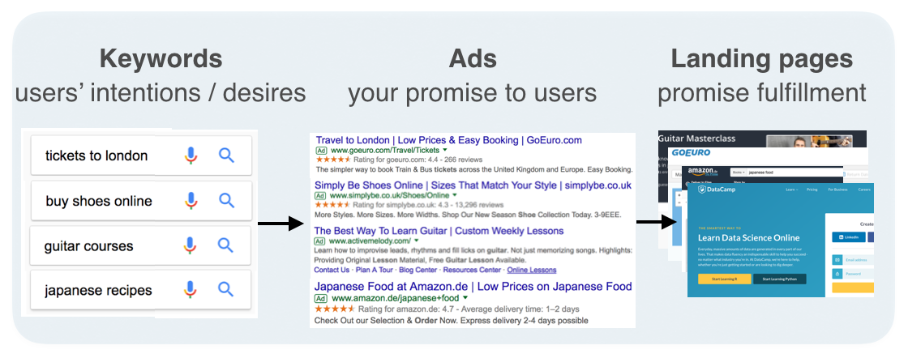

# GENERATING KEYWORDS FOR GOOGLE ADS

## OBJECTIVES

  * Generate keywords for online marketing	
  * Create word lists that we can associate with our products
  * Convert our list into a DataFrame
  * Identify matching options
  * View a summary of our campaign work
  * Save the DataFrame to a CSV file
  
##Note:
The first step is to come up with a list of words that users might use to express their desire in buying low-cost sofas or cars
Remember the words have to signify purchase intent and should
be focused on a price-sensitive audience  

*[Introductory Video ](https://www.youtube.com/watch?v=m4SaXPVidWk)  
*[More on Data Science for Search Engine Marketing (SEM)](https://www.datacamp.com/community/tutorials/sem-data-science) 
*[More on Matching Options ](https://support.google.com/google-ads/answer/7478529) 
*[Google Keyoword Planner ](https://ads.google.com/home/tools/keyword-planner/)

